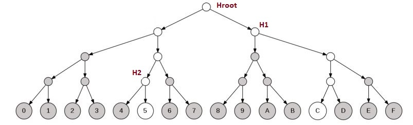

This assumes prior knowledge of [Merkle Trees](https://en.wikipedia.org/wiki/Merkle_tree) and Merkle proofs.

## Intro to Sparse Merkle Trees

A sparse Merkle tree (SMT) is a Merkle tree that contains a leaf for every possible output of a hash function. In other words, an SMT has 2^N leaves for a hash function with a N-bit output, so for example when using SHA-256 this means 2^256 leaves. Each level (nodes of the same height) of the tree corresponds to the bit of the hash value, going down the tree corresponds to going from the most significant bit to the least significant bit, choosing left or right child depending on the bit value.

Since the full in-memory representation of an SMT is impractical (to say the least) we have to simulate it, and it turns out that simulation is practical. This is because the tree is sparse: most leaves are empty, so when we calculate the hash of the empty leaves we get the same hash. The same is true for interior nodes whose children are all empty, and so on.

This means that only the hashes for the `n` Merkle branches need to be computed, where `n` is the number of keys stored in the tree.

It is valuable to pre-compute a set of default hashes for all `q` levels:

- At level 0, the default hash is `H(0)`
- At level 1, the default hash is `H(H(0) || H(0))`
- At level 2, the default hash is `H(H(H(0)|| H(0)) || H(H(0) || H(0)))`
... and so on

In a sparse tree almost all level 1 nodes have the value `H(0 || 0)`, almost all level 2 nodes have the value `H(H(0 || 0)|| H(0 || 0))`, and so on. Only nodes that lead to a non-zero leaf value actually need to be computed individually - the rest have the same value and we can compute them efficiently.

Here's an illustration of the simplified SMT storing 4-bit values. Here to store the keys `5` and `C` we only need to compute the hashes corresponding to white circles, all grey circles are default hashes and should not be duplicated in the storage.

## Sparse Merkle proofs

Unlike a proof in a usual Merkle tree, proofs in SMT are NOT `q` N-bit hashes going all the way from level 0 at the leaf all the way to the root! 

Instead, it has a format `(proofBits, proofBytes)`, where  `proofBits`  is `q` bits that can compactly represent whether the sisters going up to the root are default hashes or not – that is, for each bit:

- 0 means "use the default hash"
- 1 means "use 32 bytes in `proofBytes`"

And `proofBytes` contains just the non-default hashes. If we don't store any special values in the tree associated with each key (that is, we want to represent a "set" of values, similar to `std::set`), it is natural to keep at the leaves of the tree the values 0 and 1.

Examples
- The proof of `5` existence in the tree illustrated below is: `(0b0001, H1, Hroot)`
- The proof of `6` non-existence: `(0b0101, H2, H1, Hroot)`
